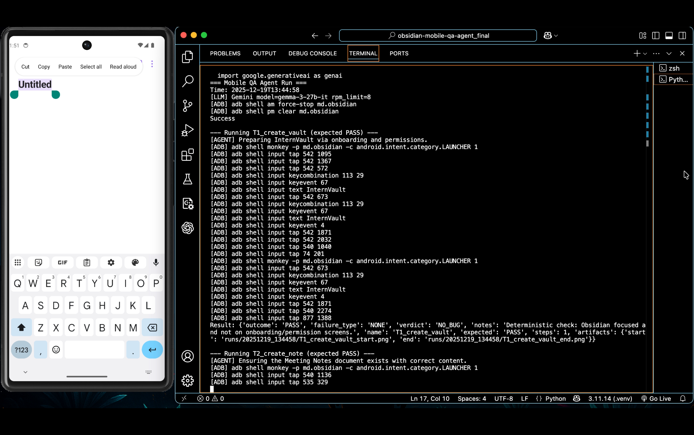

# Mobile QA Multi-Agent System (Obsidian on Android)

This project presents a multi-agent system that functions as a **full-stack mobile QA team** for end-to-end testing of the Obsidian Android application.

Using a Supervisor–Planner–Executor architecture, the system interprets natural-language QA test tasks, executes UI actions on a real Android emulator via ADB, and evaluates application state using UI hierarchy (uiautomator XML) snapshots and screenshots as structured state representations.

**Google ADK** is used to orchestrate the Supervisor–Planner–Executor workflow via the included mobile_qa_adk/ integration, while an **LLM (Gemini)** provides planning and adjudication. Deterministic fallbacks/assertions handle system flows and enforce task-specific checks.

The goal is a QA harness with reproducible runs, auditable traces, and clear separation between execution failures and assertion failures.


### Demo video (full end-to-end run): ###

[](https://drive.google.com/file/d/1DY2TgG5hBg4yD4AUEPjiNPkew7Si7lWC/view?usp=drive_link)

**Demo video:** Click the image above to watch a full end-to-end run showing the Android emulator, real-time ADB interactions, and terminal output.

## Architecture & Agent Framework

This project implements a Supervisor–Planner–Executor mobile QA agent.

- **Agent Framework:** Google Agent Development Kit (ADK)
- **LLM:** Gemini (configurable via environment variables)
- **Execution Model:** Screenshot + UI-dump grounded planning with deterministic ADB execution

### How ADK Is Used
- The ADK integration lives in `mobile_qa_adk/agent.py`, which exposes this system as an ADK-compatible agent with tools.
- The core execution engine (Planner, Executor, Supervisor, deterministic guardrails, and test loop) lives in `main.py`.
- This separation allows the system to be run:
  - directly via CLI (`python main.py`), and
  - via Google ADK for agent orchestration and tooling.

This mirrors how agent frameworks are commonly used in practice: ADK handles orchestration and tool exposure, while the core QA logic remains framework-agnostic and testable.


## Prerequisites

- Python 3.10+ recommended
- Android SDK platform-tools (so `adb` is available in your PATH)
- A running Android emulator (Pixel 6 / API 34+ recommended)
- Obsidian installed on the emulator (APK install or Play Store)


## Getting Started

1. Install **Android Studio** and create an Android Virtual Device, using:
   - System Image: Google Play APIs
   - Device: Pixel 6 or newer  
   - API Level: 34+  

2. Start the emulator in a clean state (snapshots disabled):

```bash
# macOS (default SDK location)
EMULATOR_NAME="YOUR_AVD_NAME"
~/Library/Android/sdk/emulator/emulator \
  -avd "$EMULATOR_NAME" \
  -no-snapshot

# Linux (common SDK location)
EMULATOR_NAME="YOUR_AVD_NAME"
~/Android/Sdk/emulator/emulator \
  -avd "$EMULATOR_NAME" \
  -no-snapshot

# Windows (PowerShell)
$env:EMULATOR_NAME="YOUR_AVD_NAME"
& "$env:LOCALAPPDATA\Android\Sdk\emulator\emulator.exe" `
  -avd $env:EMULATOR_NAME `
  -no-snapshot
```
Ensure the path is correct.

3. Install the Obsidian Android application:

```bash
adb install -r /path/to/Obsidian.apk
```


4. Launch Obsidian once manually to confirm it opens successfully.

> **Note:** This project assumes a single connected Android device or emulator.  
> If multiple devices are connected, set `ANDROID_SERIAL` so ADB targets the correct emulator.

```bash
# macOS/Linux
# If multiple devices are connected:
adb devices -l
export ANDROID_SERIAL="emulator-5554"

# Windows (PowerShell)
adb devices -l
$env:ANDROID_SERIAL="emulator-5554"
```


5. Create and activate a virtual environment, then install the dependencies:

```bash
# macOS/Linux
python -m venv .venv
source .venv/bin/activate
python -m pip install --upgrade pip
pip install -r requirements.txt

# Windows (PowerShell)
python -m venv .venv
.\.venv\Scripts\Activate.ps1
python -m pip install --upgrade pip
pip install -r requirements.txt
```


6. Set your Gemini API key before running the agent:

```bash
# macOS/Linux
export GEMINI_API_KEY="YOUR_API_KEY"

# Windows (PowerShell)
$env:GEMINI_API_KEY="YOUR_API_KEY"
```


7. Optional tuning parameters (sensible defaults are used if unset):

```bash
# macOS/Linux
export GEMINI_MODEL="(optional) set to your preferred Gemini model"
export GEMINI_RPM=8

# Windows (PowerShell)
$env:GEMINI_MODEL="(optional) set to your preferred Gemini model"
$env:GEMINI_RPM="8"
```

Note: You can set GEMINI_MODEL to any supported model available to your API key; the runner also works with sensible defaults if unset.
Example: during development I ran with `GEMINI_MODEL="gemma-3-27b-it"` (any supported model works).

## Running the QA System

Run the full QA test suite:

```bash
python main.py
```

Each run creates a timestamped directory under `runs/` containing screenshots and a `results.jsonl` log (one JSON object per test with a structured verdict; some tests also include step history and start/end screen descriptions). The runner reads uiautomator XML at runtime for element targeting and screen summarization.

Expected outcomes:
- T1: PASS
- T2: PASS
- T3: FAIL (FAILED_ASSERTION)
- T4: FAIL (FAILED_STEP)


### Results

Each run writes a `runs/YYYYMMDD_HHMMSS/results.jsonl` file (JSON Lines), with **one JSON object per test**.

Every test result includes (at minimum):
- `test_name`
- `expected`
- `outcome` (`PASS` / `FAIL`)
- `failure_type` (`NONE` / `FAILED_STEP` / `FAILED_ASSERTION`)
- `verdict` (`NO_BUG` / `BUG` / `UNKNOWN`)
- `notes`
- `artifacts` (paths to screenshots; may include start/end/error images depending on the test)

Some tests may also include:
- `history` (step-by-step action trace)
- `start_screen_desc`
- `end_screen_desc`

These optional fields are most consistently present for tests that run the full Planner-Executor-Supervisor loop.

Artifacts are saved under `runs/YYYYMMDD_HHMMSS/`, typically including:
- `<test>_start.png` and `<test>_end.png`
- Additional task-specific evidence screenshots (e.g., assertion/error captures)


## System Design

- **Planner**: Converts each natural-language test case into a **structured JSON action plan** (ordered steps the Executor can run).
- **Executor**: Executes the plan **deterministically** using **ADB actions** and **UI XML targeting**, with reliability handling such as **retries** and **UI refresh**.
- **Supervisor**: Uses the **step history** and **final app state** to determine **PASS/FAIL** and label the failure type (for example `FAILED_STEP` vs `FAILED_ASSERTION`).

The runner frequently reads uiautomator XML for element targeting, and captures screenshots at key checkpoints (start/end and certain recovery/assertion points) for traceability. The Supervisor is given the run history plus end-state artifacts to make the final judgment.

### Deterministic guards
To reduce LLM “hallucinated” failures, the runner includes a small set of deterministic guards:
- sanity checks for known onboarding / app-ready states
- task-specific validators for the intentionally failing tests (e.g., red-accent assertion checks, menu-option-not-found checks such as “Print to PDF”)
These guards add evidence to the run trace and may short-circuit when the outcome is unambiguous.


## QA Test Suite

The QA test suite is defined and executed from **`main.py`** and includes a deliberate mixture of passing and failing tests.

- **`T1_create_vault`** *(expected PASS)*  
  Launch Obsidian, create a new vault named `InternVault`, and enter the vault.
- **`T2_create_note`** *(expected PASS)*  
  Create a new note titled `Meeting Notes` and type `Daily Standup` into the note body.
- **`T3_assert_red_icon`** *(expected FAIL - assertion)*  
  Locate Settings -> Appearance and assert that the **accent color swatch** is red.  
  This test is expected to fail because the default theme does not use a red accent color. 
- **`T4_print_to_pdf`** *(expected FAIL - step)*  
  Locate and click a “Print to PDF” option in the main file menu in the mobile UI.  
  This test is expected to fail because the option is not present in that location on Obsidian mobile, so the agent should report an inability to complete the step (`FAILED_STEP`).


## Result Schema and Failure Taxonomy

For each test case, the system produces a structured result containing:

- `outcome`: `PASS` or `FAIL`
- `failure_type`: 
    - `NONE`: the test completed successfully.
    - `FAILED_STEP`: the agent could not complete an intended interaction despite retries (e.g., a tap/typing action cannot be performed, navigation fails, or the agent becomes stuck).
    - `FAILED_ASSERTION`: the agent reached the intended screen/menu and completed the interaction sequence, but the expected condition was not satisfied (e.g., a state/value/color mismatch).
- `verdict`: `NO_BUG` or `BUG` (whether a failure indicates an application defect vs. an expected mismatch / unsupported capability)

For this project, all FAIL outcomes are expected by design and therefore correctly classified as `NO_BUG`.

In addition to the JSON verdict, the runner writes supporting artifacts (screenshots and step history/screen summaries in results.jsonl) to enable post-run inspection and reproducibility.


## Repository Contents

This repository implements an Android UI testing framework centered on a single orchestration engine and a modular agent architecture. The system separates decision-making (planning and evaluation) from actuation (device interaction), enabling reproducible test execution while retaining flexibility for agent-driven control.

- **`main.py`**  
  Execution Orchestrator
  The primary entry point and control plane. It defines the QA tests (T1-T4), coordinates the Planner–Executor-Supervisor loop, handles onboarding, enforces deterministic fallbacks, and manages run artifacts (screenshots and structured results in results.jsonl). UI XML is used during execution and summarized for the LLM.

- **`adb/`**  
  Device Control Layer
  A thin ADB abstraction providing reliable Android interactions and state inspections, including taps, text input, swipes, key events,  screenshot capture, UI hierarchy XML retrieval, and launching the app. This layer isolates platform-specific command execution from higher-level agent logic.

- **`agents/`**  
  Agent Roles and Shared Utilities
  Implements the core agentic components and supporting infrastructure:
    - **Planner agent:** Produces structured action sequences (JSON) conditioned on the current UI state and test specification.
    - **Executor agent:** Realizes actions on the device using UI-dump parsing, element retrieval, and robust matching heuristics (e.g., text/content-desc resolution and normalization/partial matching).
    - **Supervisor agent:** Generates outcome judgments (PASS/FAIL) and diagnostic classifications.
    - **Screen reader:** Converts raw uiautomator XML into compact, model-consumable state descriptions, prioritizing interactive elements to improve action grounding.
    - **Prompting and LLM client:** Centralized prompt templates plus a Gemini interface that includes rate limiting, retry logic, and caching for stability and cost control.
    - **Android helpers:** Deterministic routines for common navigation and special-case flows, including system permission screens and task-specific assertions (e.g., pixel-based checks).

- **`mobile_qa_adk/`**  
  Google ADK Integration Layer
  An adapter that exposes the runner and task suite through a Google ADK-compatible interface, enabling standardized invocation (e.g., listing available tests, running a single test, or executing the full suite).

- **`requirements.txt`**
  Environment Specification
  Declares runtime dependencies for LLM integration, ADK tooling, and image-processing utilities used by deterministic assertions and artifact handling.

